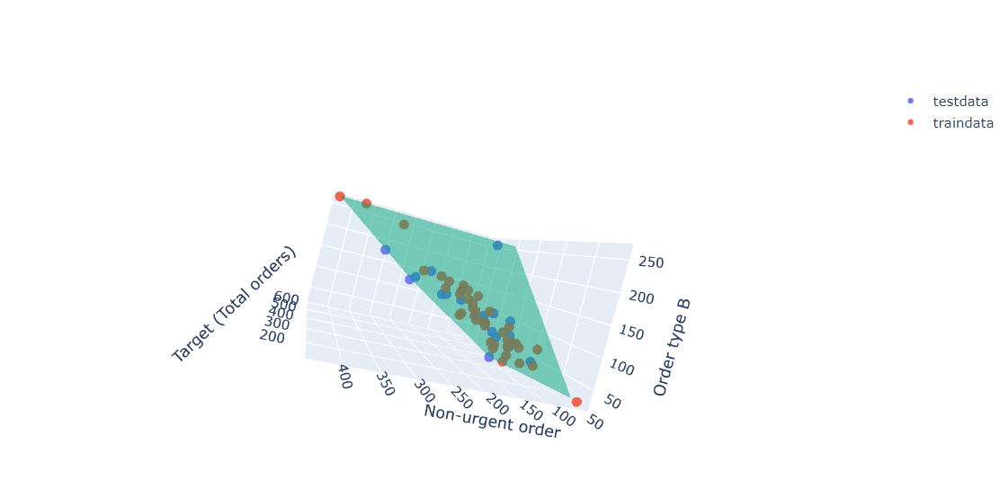
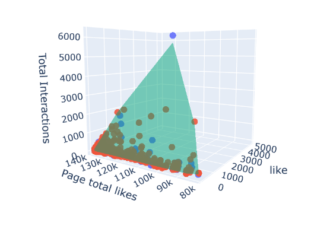

## Курс по машинному обучению Университета ИТМО

[lbRegression](https://github.com/1234514321/ITMO_ML/blob/master/regression_lb1.ipynb)

[lbClassification](https://github.com/1234514321/ITMO_ML/blob/master/Classification_lb2%20(1).ipynb) 

[lbKneighborsClassifier](https://github.com/1234514321/ITMO_ML/blob/master/KneighborsClassifier_lb3.ipynb) 

### LbRegression
#### Обучение с учителем

Методы обучения с учителем применяются тогда, когда для имеющихся объектов обучающей выборки мы знаем так называемые ответы, а для новых объектов мы хотим их предсказать. То есть, для применения этих методов нам необходима размеченная обучающая выборка.

В зависимости от того, что вы хотите предсказать, обучение с учителем может использоваться для решения двух типов задач: задача регрессии и задача классификации.

Задача регрессии:

Если вы хотите спрогнозировать непрерывные значения, например, попытаться спрогнозировать стоимость квартиры или погоду на улице в градусах, используйте регрессию. Этот тип задач не имеет определенного ограничения значений, поскольку значение может быть любым числом без ограничений.

Задача классификации:

Если требуется спрогнозировать дискретные значения, например классифицировать что-либо по категориям, используйте классификацию. Вопрос «Будет ли человек делать покупку», имеет ответ, который попадает в две конкретные категории: да или нет. Число допустимых ответов конечно.

##Регрессия

Регрессия ищет отношения между переменными.

Для примера можно взять сотрудников какой-нибудь компании и понять, как значение зарплаты зависит от других данных, таких как опыт работы, уровень образования, роль, город, в котором они работают, и так далее.

Регрессия решает проблему единого представления данных анализа для каждого работника. Причём опыт, образование, роль и город – это независимые переменные при зависимой от них зарплате.

Таким же способом можно установить математическую зависимость между ценами домов в определённой области, количеством комнат, расстоянием от центра и т. д.

Регрессия рассматривает некоторое явление и ряд наблюдений. Каждое наблюдение имеет две и более переменных. Предполагая, что одна переменная зависит от других, вы пытаетесь построить отношения между ними.

Другими словами, вам нужно найти функцию, которая отображает зависимость одних переменных или данных от других.

Зависимые данные называются зависимыми переменными, выходами или ответами.

Независимые данные называются независимыми переменными, входами или предсказателями.

Обычно в регрессии присутствует одна непрерывная и неограниченная зависимая переменная. Входные переменные могут быть неограниченными, дискретными или категорическими данными, такими как пол, национальность, бренд, etc.

Общей практикой является обозначение данных на выходе – y, входных данных – x. В случае с двумя или более независимыми переменными, их можно представить в виде вектора X = (x₁, …, xᵣ), где 𝑟 – количество входных переменных.

###Линейная регрессия (метод найменьших квадратов)

Линейная регрессия – одна из важнейших и широко используемых техник регрессии. Эта самый простой метод регрессии. Одним из его достоинств является лёгкость интерпретации результатов.

Оценочная функция регрессии (чёрная линия) выражается уравнением f(x) = b₀ + b₁x. Нужно рассчитать оптимальные значения спрогнозированных весов b₀ и b₁ для минимизации SSR (сумма квадратов регрессии) и определить оценочную функцию регрессии. Величина b₀, также называемая отрезком, показывает точку, где расчётная линия регрессии пересекает ось y. Это значение расчётного ответа y(x) для x = 0. Величина b₁ определяет наклон расчетной линии регрессии.

Предсказанные ответы (красные квадраты) – точки линии регрессии, соответствующие входным значениям. Для входа x = 5 предсказанный ответ равен f(5) = 8.33 (представленный крайним левыми квадратом).

Остатки (вертикальные пунктирные серые линии) могут быть вычислены как yᵢ − f(xᵢ) = yᵢ − b₀ − b₁xᵢ для i = 1, …, 𝑟 . Они представляют собой расстояния между зелёными и красными пунктами. При реализации линейной регрессии вы минимизируете эти расстояния и делаете красные квадраты как можно ближе к предопределённым зелёным кругам.

####Основные шаги:

1.Импортируйте необходимые пакеты и классы.

2.Предоставьте данные для работы и преобразования.

3.Создайте модель регрессии и приспособьте к существующим данным.

4.Проверьте результаты совмещения и удовлетворительность модели.

5.Примените модель для прогнозов.

#Задание:

1) Взять один из наборов данных, представленных ниже. Согласовать выбор с преподавателем. Данные взяты с этого репозитория.

Behavior of the urban traffic of the city of Sao Paulo in Brazil

dataset_Facebook

SkillCraft1_Dataset

2. Выбрать из признаков один или два, оказывающих наибольшее влияние на целевую переменную. Подготовить данные, разделить их на тренировочный и тестовый сет.
3. Создать регрессионную модель (простую или множественную, в зависимости от выбранного количества признаков)
4. Обучить ее на тренировочных данных
5. Оценить результаты обучения
6. Примените модель для прогнозов на тестовой выборке
7. Для простой линейной регрессии сделайте визуализацию, для множественной по возможности
8. Сделайте выводы по результатам лабораторной работы

### LbClassification

Обучение с учителем (обучение на размеченных данных) используется для решения двух основных типов задач: регрессия и классификация. Пример регрессии мы рассмотрели на прошлом занятии. В этой лабораторной работе рассмотрим классификацию.

##Классификация

Простыми словами, классификация - это предсказание категории объекта. То есть, необходимо разделить объекты по заранее известному признаку: шарики по цветам, документы по языкам, музыку по жанрам. Примеры задач классификации:

Спам-фильтры
Определение языка
Поиск похожих документов
Анализ тональности
Распознавание рукописных букв и цифр
Определение подозрительных транзакций
Задача классификации состоит в определении к какому классу из, как минимум, двух изначально известных относится данный объект. Обычно таким объектом является вектор в n-мерном вещественном пространстве ℝ𝕟. Координаты вектора описывают отдельные аттрибуты объекта. Например, цвет c, заданный в модели RGB, является вектором в трехмерном пространстве: c=(red, green, blue).

Математическая формулировка задачи классификации такова: пусть 𝑋 — пространство объектов (например, ℝ𝕟), 𝑌 — наши классы (например, 𝑌 = {-1,1}). Дана обучающая выборка: (𝑥1,𝑦1),...,(𝑥𝑚,𝑦𝑚). Требуется построить функцию 𝐹:𝑋→𝑌 (классификатор), сопоставляющий класс 𝑦 произвольному объекту 𝑥.

Если классов всего два («спам / не спам», «давать кредит / не давать кредит», «красное / черное»), то задача называется бинарной классификацией. Если классов несколько — многоклассовая (мультиклассовая) классификация.

Примеры алгоритмов, используемых для классификации: Наивный Байес, Деревья Решений, Логистическая Регрессия, K-ближайших соседей, Метод Опорных Векторов.

###Метод опорных векторов

Пожалуй, одним из самых популярным методом классификации является метод опорных векторов (Support Vector Machine — SVM). Данный метод изначально относится к бинарным классификаторам, хотя существуют способы заставить его работать и для задач мультиклассификации.

Идея SVM по своей сути проста: он ищет, как так провести две прямые между категориями, чтобы между ними образовался наибольший зазор.

С точки зрения точности классификации лучше всего выбрать прямую, расстояние от которой до каждого класса максимально. Другими словами, выберем ту прямую, которая разделяет классы наилучшим образом (красная прямая на рисунке выше). Такая прямая, а в общем случае — гиперплоскость, называется оптимальной разделяющей гиперплоскостью.

Алгоритм SVM устроен таким образом, что он ищет точки на графике, которые расположены непосредственно к линии разделения ближе всего. Эти точки называются опорными векторами. Затем, алгоритм вычисляет расстояние между опорными векторами и разделяющей плоскостью. Это расстояние которое называется зазором. Основная цель алгоритма — максимизировать расстояние зазора. Лучшей гиперплоскостью считается такая гиперплоскость, для которой этот зазор является максимально большим.

####Линейная неразделимость

На практике случаи, когда данные можно разделить гиперплоскостью, или, как еще говорят, линейно, довольно редки. 

####Основные шаги:

1. Импортируем необходимые библиотеки
2. Скачиваем данные
3. Готовим данные, делим датасет на тренировочную и тестовую выборку
4. Обучаем модель
5. Предсказываем результат для тестовой выборки
6. Оцениваем модель
7. Делаем выводы

### Дерево решений
Вторым, рассматриваемым в этой лабораторной, методом является Дерево решений. Решение, в какой класс причислить объект, программа принимает на основе множества вопросов, ответами на которые является "да" или "нет".

Структура дерева представляет собой «листья» и «ветки». На рёбрах («ветках») дерева решения записаны атрибуты, от которых зависит целевая функция, в «листьях» записаны значения целевой функции, а в остальных узлах — атрибуты, по которым различаются случаи. Чтобы классифицировать новый случай, надо спуститься по дереву до листа и выдать соответствующее значение.

Деревья разделяются на уровни, и, чем выше уровень, тем более общий должен быть вопрос.

В реальной жизни чаще всего используется не одно Дерево решений, а так называемый алгоритм Случайного леса (random forest).

#### Задание
1. Возьмите датасет Heart Disease или Pulsar Star и сравните результаты применения метода опорных векторов и метода деревьев на выбранном датасете.
2. При применении метода деревьев обучите классификатор дважды: без ограничений и с ограничениями одного или нескольких основных параметров.
3. Постройте визуализацию дерева.

LbKneighborsClassifier

В двух предыдущих лабораторных работах мы рассматривали классические методы машинного обучения, которые относились к категории "Обучение с учителем". То есть, у нас был вектор X с признаками (атрибутами) и вектор Y c правильными ответами. При обучении без учителя у нас есть только объекты  𝑋={𝑥1,𝑥2,...,𝑥𝑚}∈ℝ𝕟  и нет ответов к ним, то есть мы имеем неразмеченную выборку.

Обучение без учителя можно поделить на три основных типа задач:

кластеризация
уменьшение размерности (обощение)
поиск правил (ассоциация)
Самой известной и популярной, пожалуй, является кластеризация.

Примеры применения кластеризации:

Сегментация рынка (типов покупателей, лояльности)
Объединение близких точек на карте
Сжатие изображений
Анализ и разметки новых данных
Детекторы аномального поведения
Постановка задачи:

Дано: объекты  𝑋={𝑥1,𝑥2,...,𝑥𝑚}∈ℝ𝕟
Требуется разбить это множество объектов на группы таким образом, чтобы элементы внутри одной группы были похожи друг на друга, а элементы из разных групп отличались. Такие группы похожих объектов мы будем называть кластеры.

Следует отличать методы кластеризации от методов классификации. Методы классификации — это методы обучения с учителем. Это значит, что для каждого объекта нам известна его истинная метка принадлежности к классу. Затем, имея истинные метки, предсказания алгоритма и некоторую функцию потерь, алгоритмы классификации как-то подстраиваются так, чтобы допускать меньше ошибок на данных. Алгоритмы же кластеризации никак не используют информацию об истинных метках объектов и оперируют лишь похожестью объекта. Ну а что такое похожесть, в каждом алгоритме кластеризации определяется по-своему.

Основная цель кластеризации заключается в том, чтобы выявить структуру в данных. С помощью методов кластеризации мы можем автоматически найти группу похожих объектов, возможно, выделить аномалии, какие-то изолированные объекты, которые требуют дополнительного изучения или выбрасывания из данных, и кластеризация позволяет провести более детальный анализ самих кластеров. Иногда бывает полезно построить отдельные модели на каждом кластере вместо того, чтобы строить одну модель на всех данных и получить какой-то мусор.

Существует очень много методов кластеризации.

методы кластеризации на основе прототипов
иерархические методы кластеризации
плотностные методы кластеризации
...
Методы разбиения на основе прототипов заключаются в том, что кластеры характеризуются некоторым базовым элементом или прототипом. Например, в методе k-средних кластер характеризуется центроидом — центром масс объектов, из которых он состоит. Обычно в результате применения алгоритмов из этой группы мы получаем строгое разбиение всех наших объектов на кластеры, то есть одному объекту соответствует одна метка кластера.

Иерархические алгоритмы позволяют получить целую структуру вложенных друг в друга кластеров. Иногда это бывает полезно для того, чтобы понять вообще структуру наших данных от начала до конца.

Плотностные методы кластеризации действуют совершенно иначе. В них кластер определяется, как область с большой плотностью точек, с большой плотностью объектов. Такая формулировка кластера позволяет выявлять произвольные формы кластеров и выделять объекты-выбросы, то есть элементы, вокруг которых нет других точек.

В рамках данной лабораторной работы мы рассмотрим метод k-means (к-средних), относящийся к методам кластеризации на основе прототипов.

##Метод К-средних

Итак, у нас есть некоторой множество объектов 𝑋={𝑥1,𝑥2,...,𝑥𝑚}∈ℝ𝕟. Мы хотим разделить это множество на 𝐾 кластеров, каждый из которых характеризуется центроидом:

Кластер 𝐶𝑘↔ центроид 𝜇𝑘
Объект относится к соответствующему кластеру, если его центроид находится ближе других центроидов к этому объекту:

объект 𝑥𝑖∈𝐶𝑘⇔𝜇𝑘=𝑎𝑟𝑔 𝑚𝑖𝑛𝜇𝑗||𝑥𝑖−𝜇𝑖||2
Будем кластеризовывать объекты таким образом, чтобы минимизировать сумму квадратов расстояния между объектом и ближайшим к нему центроидом по всем кластерам:

𝐿(𝐶)=∑𝑗=1𝑘∑𝑥𝑖∈𝐶𝑗||𝑥𝑖−𝜇𝑗||2

Если взять производную по 𝜇, то становится понятно, что лучше всего выражать центроид именно как центр масс объектов, которые относятся к соответствующему кластеру.

𝜇𝑘=∑𝑥𝑖∈𝐶𝑘𝑥𝑖|𝐶𝑘|

Теперь у нас есть формулировка критерия и мы знаем, как считать центроид. Но для того, чтобы найти глобальный минимум этого функционала нужно перебирать все возможные разбиения объектов на к-кластеров, что, конечно же, не так интересно. Спасает нас алгоритм к-средних, который позволяет найти локальный минимум этого критерия.

Алгоритм k-средних¶
Вход: Объекты 𝑋, 𝑘 - количество кластеров

Инициализация центроидов 𝜇1,𝜇2,...,𝜇𝑘
Обновление кластеров: объекты приписываются к ближайшему центроиду
Обновление центроидов: пересчет положения центроидов как центр масс объектов, которые лежат в соответствующем кластере
Шаги 2 и 3 продолжаются до тех пор пока не выполнятся некоторые правила остановок, например, будет достигнуто какое-то максимальное количество итераций или пока кластеры не перестанут меняться.

####Варианты начальной инциализации

Базовые варианты начальной инициализации центроидов:

1. выбрать k-случайных объектов в наших данных в качестве центроидов и уже с этих центроидов начинать следующие шаги алгоритма.
2. использовать k-кластеров полученных после применения иерархической кластеризации с методом Уорда.
3. метод К-Means++: Первый центроид мы будем выбирать случайным образом среди всех точек в данных, которые у нас есть. Для каждой точки мы будем рассчитывать расстояние до ближайшего центроида, который ранее был уже нами инициализирован. В качестве следующего центроида мы будем выбирать также точки наших данных, но с вероятностью пропорционально как раз этому расстояние, которое мы посчитали на шаге предыдущем.

Сильные стороны алгоритма:

Сравнительно высокая эффективность при простоте реализации
Высокое качество кластеризации
Возможность распараллеливания
Существование множества модификаций
Недостатки алгоритма:

Количество кластеров является параметром алгоритма
Чувствительность к начальным условиям (Инициализация центров кластеров в значительной степени влияет на результат кластеризации)
Чувствительность к выбросам и шумам (Выбросы, далекие от центров настоящих кластеров, все равно учитываются при вычислении их центров)
Возможность сходимости к локальному оптимуму (Итеративный подход не дает гарантии сходимости к оптимальному решению)
Использование понятия "среднего" (Алгоритм неприменим к данным, для которых не определено понятие "среднего", например, категориальным данным)
слабая классификация сложных данных (ленточных кластеров, вложенных, пересекающихся и т.д.)

##Метод DBSCAN

DBSCAN (Density-based spatial clustering of applications with noise, плотностной алгоритм пространственной кластеризации с присутствием шума), как следует из названия, оперирует плотностью данных.

Суть метода (максимально упрощенно): предположим перед лекцией несколько групп студентов находятся в коридоре и ждут, когда освободится аудитория. Предположим, каждый студент - это отдельная точка. Кто-то стоит один, кто-то кучкуется группой, кто-то стоит вдоль стен. Как же выделить в такой толпе кластеры? Находим трёх любых близко стоящих человека и говорим им взяться за руки. Затем они начинают брать за руку тех, до кого могут дотянуться. Так по цепочке, пока никто больше не сможет взять кого-то за руку — это и будет первый кластер. Повторяем, пока не поделим всех. Те, кому вообще некого брать за руку — это выбросы, аномалии. 

Значительное влияние на работу алгоритма DBSCAN оказывают два его входных параметра: eps -радиус окрестности (это максимальное расстояние на котором две точки считаются соседями и могут быть отнесены к одному кластеру) и min_samples - минимальное количество точек, образующих кластер. Подбор этих параметров - важная часть настройки данного метода. Посмотрим это на примере небольшого набора "синтетических" данных

#### Задание
1. Используйте метод K-средних и метод DBSCAN на самостоятельно сгенерированной выборке с количеством кластеров не менее 4. Для увеличения числа кластеров при генерации можно задать количество центров в функции make_blobs через параметр centers.
2. Используйте эти же два метода на датасете Mall_Customers.
3. Для каждого метода необходимо построить график.

